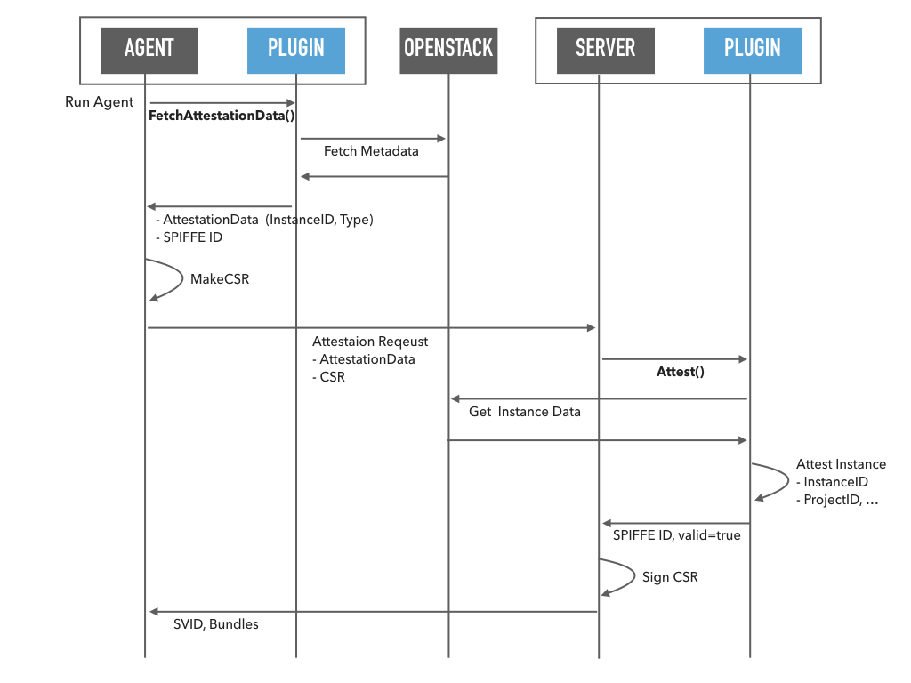

# OpenStack IID Attestor

## Overview

The OpenStack InstanceID(IID) attestor is a plugin for the SPIRE Agent and SPIRE Server that allows SPIRE to automatically attest instances using the OpenStack Instance Metadata API. Agents attested by the `openstack_iid` attestor will be issued a SPIFFE ID like `spiffe://TRUST_DOMAIN/agent/openstack_iid/PROJECT_ID/INSTANCE_ID`. This plugin requires a whitelist of ProjectID from which nodes can be attested. This also means that you shouldn't run multiple trust domains from the same OpenStack Project(**TBD**).

## Base SVID SPIFFE ID Format

```
spiffe://TRUST_DOMAIN/agent/openstack_iid/PROJECT_ID/INSTANCE_ID
```

## Diagram



## Pre-Requisites

This plugin requires a running SPIRE server and agent each on the OpenStack Nova Instances.

## Configuring the server plugin

https://github.com/spiffe/spire/blob/master/conf/server/server.conf

The server plugin configuration template is as below:

```hcl
plugins {
    NodeAttestor "openstack_iid" {
        plugin_cmd = "/path/to/plugin_cmd"
        plugin_data {
            cloud_name = "test"
            projectid_whitelist = ["123", "abc"]
            attestation_period = "5m"
        }
    }
...
```

| key | type | required | description | example |
|:----|:-----|:---------|:------------|:--------|
| cloud_name | string | ✓ | Name of cloud entry in clouds.yaml to use |  |
| projectid_whitelist | array | ✓ | List of authorized ProjectIDs | |
|attestation_period | string | | If specified, an attestation request must be made within this time period. | 5m (Go-style time duration) |

The plugin_name should be "openstack_iid" and matches the name used in plugin config. The plugin_cmd should specify the path to the plugin binary.

### Setup openstack configuration file (clouds.yaml) on instances

see: https://docs.openstack.org/python-openstackclient/pike/configuration/index.html

## Configuring agent plugin

https://github.com/spiffe/spire/blob/master/conf/agent/agent.conf

The agent plugin configuration template is as below:

```hcl
plugins {
    NodeAttestor "openstack_iid" {
        plugin_cmd = "/path/to/plugin_cmd"
        plugin_data {
        }
    }
...
```

The plugin_name should be "openstack_iid" and matches the name used in plugin config. The plugin_cmd should specify the path to the agent binary. 

## Security Consideration

At this time OpenStack doesn't have signature for Identity information like AWS Instance Identity Documents or GCP's GCP Instance Identity Token. Therefore, Server can't prevent spoofing by a malicious Agent.
As a mitigation measure, re-attestation of the same instance is prohibited, and we can set the period from instance startup to attestation request.
In the future, if it is possible to acquire Agent address information in the Server Plugin, it is possible to identify more strictly by comparing the IP address of the request source and the IP address associated with the instance obtainable from the metadata of the instance.
