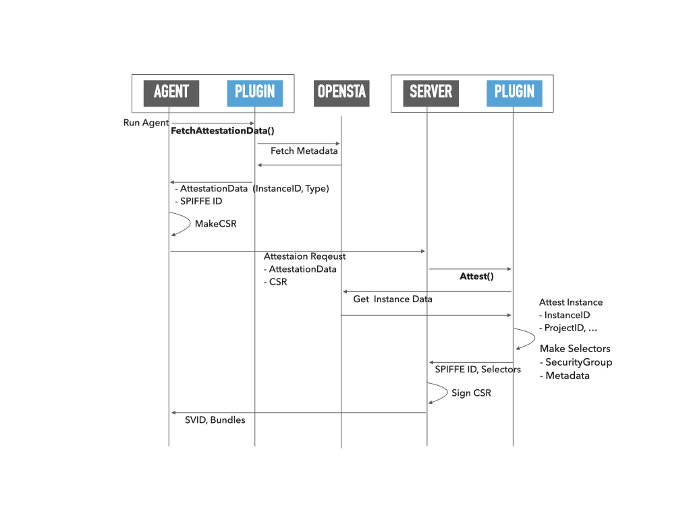

# spire-openstack-plugin
This repository contains the OpenStack based SPIRE plugins.

## Node Attestor 'openstack-iid' Plugin

The `openstack_iid` attestor is a plugin for the SPIRE Agent and SPIRE Server that allows SPIRE to automatically attest instances using the OpenStack Instance Metadata API.

### Documents

[Plugin Documents](doc/openstack-iid-attestor.md)

### Diagram

## LICENSE

This software is released under the MIT License.